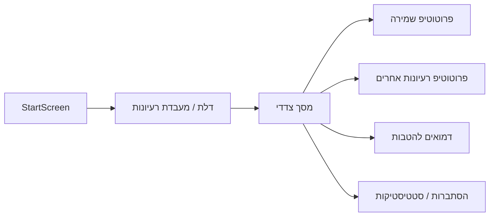

# תוכנית צדדית, דלת להטבות, והסתברות סיום משחק

## 1. ארכיטקטורה: תוכנית צדדית + "דלת" במסך הפתיחה

**עיקרון:** לא לממש פיצ'רים חדשים בתוך ליבת המשחק הקיים. לבנות **מרחב צדדי** (מודול/תת-אפליקציה) שכל האופציות העתידיות ייבנו שם, ובמסך הפתיחה תהיה **דלת** (כפתור/מסך) שמגיעה אליו. אינטגרציה למשחק הראשי תתאפשר רק אחרי אישור.

**מימוש מוצע:**

- **מסך פתיחה נוכחי** ([card/index.tsx](card/index.tsx) – `StartScreen`): להוסיף כפתור/אייקון ברור: "מעבדת רעיונות" / "אופציות עתידיות" / "דלת" – ניווט למסך חדש (למשל `FutureLabScreen` או `ExperimentsScreen`).
- **מסך צדדי חדש:** רשימת כרטיסים/כפתורים – כל פריט מוביל ל**פרוטוטיפ נפרד**:
  - קלף שמירה (מגן) – גרסת ניסוי עם חוקים מלאים, בלי לגעת ב-reducer הראשי.
  - קלף חזקה, אפס, שינוי קובייה, גניבה – כל אחד במסך/מודול משלו.
  - מצב מאתגר (4 קוביות / 3 פעולות) – גרסת ניסוי.
  - כל רעיון הטבה (למטה) – לינק למסך/דמו ייעודי.
- **נתיב קוד:** מומלץ תיקייה ייעודית, למשל `card/src/future/` או `card/screens/FutureLab/`: רכיבי המסך הצדדי, פרוטוטיפים, ולוגיקה מקומית (state נפרד או מודול). אין שינוי ב-`gameReducer` הראשי או ב-`GameScreen` הראשי מלבד הוספת הכפתור/דלת והניווט.

---

## 2. הטבות

רעיונות שמתאימים כהטבות – חיזוק חינוכי, מדידה, והתאמה למערכת:

- **מפת תכנית לימודים:** טבלה/מסך שמציג אילו נושאים במתמטיקה (חשבון, שברים, סדר פעולות, התאמה למספרים) ממומשים במשחק, עם ציון כיתה/שכבה (א'-ו' או ז'-ט'). מאפשר להציג "המשחק מכסה את נושא X מתוך תכנית הליבה".
- **דשבורד למורה (דמו):** מסך "מורה" שמציג סיכום כיתתי: כמה משחקים הושלמו, ממוצע תורות למשחק, שיעור הצלחה בבניית משוואות. נתונים יכולים להיות מקומיים (אחסון במכשיר) או מוכנים לרישום לשרת. יוצר רושם של "כלי ניהול למידה".
- **מצב כיתה / רב-משתתפים:** דמו או פרוטוטיפ של "חדר כיתה" – מורה מפעיל משחק, תלמידים מצטרפים (אותו רשת או סימולציה). מתאים להצגה של "משחק חברתי בכיתה".
- **דיפרנציאציה:** במסך הצדדי – פרופיל "קל/בינוני/מאתגר" (טווח מספרים, עם/בלי שברים, 2/3 קוביות) עם הסבר פדגוגי: "התאמה לרמות שונות בכיתה".
- **גישה ונגישות:** רשימת תכונות: תמיכה ב-RTL, פונט קריא, אפשרות הגדלת קלפים, הסברים קוליים (טקסט לדיבור) – מסמך או מסך "נגישות" במעבדת הרעיונות.
- **מחקר והסתברות:** מסך "סטטיסטיקות והסתברות" במעבדת הרעיונות – מציג את חישובי ההסתברות (למטה), גרפים (אורך משחק, התפלגות תוצאות), וטקסט הסבר קצר. יוצר רושם של "מתמטיקה ויישום".

כל הרעיונות האלה ימומשו או יוצגו כ**פריטים במסך הצדדי** (דלת), לא בתוך ליבת המשחק הקיים.

---

## 3. חישוב ההסתברות לסיום משחק (עם N שחקנים, קלפים עד 25, שברים)

**הגדרות מהקוד:**

- חפיסה מלאה (full, עם שברים): מספרים 0–25 ב־4 עותקים (104 קלפים), שברים 1/2, 1/3, 1/4, 1/5 (18), פעולות (16), ג'וקרים (4). **סה"כ 142 קלפים.**
- 10 קלפים לשחקן; סיום = שחקן מרוקן את היד אחרי הכרזת "כמעט סיימתי" (לולוס).

**למה אין נוסחה סגורה:**

- מרחב המצבים ענק (חלוקות קלפים, קוביות, בחירות שחקנים).
- התנהגות השחקנים אסטרטגית (לא אקראית לגמרי).
- לכן חישוב **מדויק** בהסתברות סיום (או זמן סיום) אינו מעשי בנוסחה אחת.

**גישה מעשית: סימולציה (מונטה קרלו)**

1. **משתנים:** מספר שחקנים N, חפיסה 0–25 + שברים (כבקוד).
2. **שחקן פשוט (רובוט):** בכל תור – אם יש משוואה תקפה מהקוביות ומהקלפים ביד שמאפשרים להניח קלפים לתוצאה, עושה זאת; אחרת שולף. אם יש קלף זהה לערימה (ותנאי הזהה מתקיים) – מניח. לולוס כשנותרו 1–2 קלפים.
3. **סיום ריצה:** ריצה נגמרת כששחקן מסוים מגיע ל־0 קלפים אחרי לולוס, או אחרי מכסה תורות (למניעת לולאה).
4. **איסוף:** על כל ריצה – האם הסתיימה בניצחון (כן/לא), מספר תורות. אחרי אלפי ריצות – **ההסתברות לסיום** = שיעור הריצות שהסתיימו בניצחון; **ממוצע תורות** = E[תורות עד סיום].

**נוסחה אנליטית מקורבת (גסה):**

- לא ניתן לתת P(סיום) מדויק; אפשר לתת **אומדן גס** לפי מודל מפושט: "בכל תור יש הסתברות p להנחת לפחות קלף אחד" (p תלוי בקלפים וקוביות). במודל כזה, זמן עד ל־0 קלפים הוא בערך גיאומטרי/מעריכי. אומדן גס למשחק "טיפוסי" (2 שחקנים, משחקים אופטימלית): **ההסתברות שהמשחק יסתיים (בסופו של דבר) קרובה ל־1** אם מניחים שהשחקנים לא נתקעים (תמיד יש אפשרות לשלוף ולשחק). **ממוצע תורות** – רק via סימולציה.

**המלצה:**

- ליצור **סקריפט סימולציה** (למשל ב־`card/scripts/` או בתוך המעבדת הרעיונות): לוגיקת משחק מפושטת (חפיסה, חלוקה, תורות עם רובוט פשוט), הרצה 5,000–10,000 משחקים עבור N=2 ו־N=3.
- פלט: (1) **שיעור משחקים שהסתיימו בניצחון** (ההסתברות לסיום), (2) **ממוצע וחציון תורות**, (3) אופציונלי – התפלגות אורך משחק.
- להציג את התוצאות במסך "סטטיסטיקות והסתברות" במעבדת הרעיונות (דלת).

**סיכום מספרי גס (לאחר סימולציה):**

- צפוי: **P(סיום) ≈ 1** (כמעט כל משחק יסתיים בניצחון אם יש מכסה תורות סביר ורובוט לא נתקע).
- **ממוצע תורות:** תלוי N ואסטרטגיה – להעריך רק עם סימולציה (למשל טווח טיפוסי 15–40 תורות למשחק עם 2 שחקנים).

---

## 4. סדר ביצוע מוצע

1. **דלת + מסך צדדי:** הוספת כפתור במסך הפתיחה וניווט למסך "מעבדת רעיונות" עם רשימת פריטים (בלי לוגיקה כבדה בהתחלה).
2. **מסך הסתברות/סטטיסטיקות:** במעבדת הרעיונות – מסך שמסביר את המודל ומציג (או יכניס) תוצאות סימולציה: P(סיום), ממוצע תורות.
3. **סקריפט סימולציה:** מימוש רובוט פשוט + הרצות מונטה קרלו; שמירת התוצאות (קובץ או state) להצגה באפליקציה.
4. **פרוטוטיפים והטבות:** כל רעיון כרכיב/מסך נפרד במעבדת הרעיונות, בלי לגעת ב-reducer הראשי.

אם תרצה, בשלב הבא אפשר לפרק את סעיף 1 (דלת + מסך צדדי) לרשימת משימות קוד קונקרטית (קבצים, שורות).
